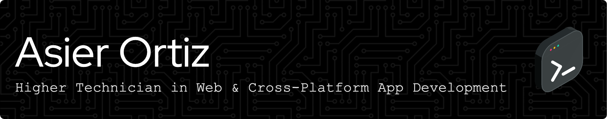

# :wave: Hey there!

I’m Asier, a Web Developer with a growing passion for Machine Learning. While I enjoy crafting dynamic web applications and seamless user experiences, I’m also diving into AI-driven solutions, predictive modeling, and model deployment. From backend architecture to front-end interactions—and now, from data pipelines to scalable ML systems—I love exploring every layer of the development process.

# :computer: Tech Stack

| Category        | Skills        |
|-----------------|---------------|
| Frameworks |   |
| Languages |      |
| Styling |    |
| Database |   |
| Services & Tools |    |

# :books: Currently Learning

# 🏆 GitHub Trophies

# </> Language Breakdown

